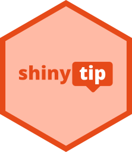

<h3 align="center">shinytip</h3>
<h4 align="center">
  💬 Simple flexible tooltips for Shiny apps
  <br><br>
  <a href="https://daattali.com/shiny/shinytip-demo/">Demo</a>
  &middot;
  by <a href="https://deanattali.com">Dean Attali</a>
</h4>

<p align="center">
  <a href="https://github.com/daattali/shinytip/actions">
    
  </a>
  <a href="https://cran.r-project.org/package=shinytip">
    
  </a>
  <a href="https://www.paypal.com/paypalme/daattali/20">
    
  </a>
</p>

---



{shinytip} lets you add tooltips to any Shiny input, output, tag, or even plain text. Just wrap any UI with `tip()` and you're done -- no setup needed, no JavaScript involved.

Tooltips can be customized in a variety of ways, such as position, width, colours, font size, etc.
They also work in all the places where other tooltips sometimes break, such as dynamic UI, modals, and Rmd/qmd document.
Shiny inputs can even emit a different tooltip based on whether the input is enabled or disabled.
See the [demo Shiny app](https://daattali.com/shiny/shinytip-demo/) online to play around with all the options.

**Need Shiny help? [I'm available for consulting](https://attalitech.com/).**<br/>
**If you find {shinytip} useful, please consider [supporting my work](https://github.com/sponsors/daattali)! ❤**

<p align="center">
  <a style="display: inline-block;" href="https://github.com/sponsors/daattali">
    
  </a>
</p>

> This package is part of a larger ecosystem of packages with a shared vision: solving common Shiny issues and improving Shiny apps with minimal effort, minimal code changes, and clear documentation. Other packages for your Shiny apps:

| Package | Description | Demo |
|---|---|---|
| [shinyjs](https://deanattali.com/shinyjs/) | 💡 Easily improve the user experience of your Shiny apps in seconds | [🔗](https://deanattali.com/shinyjs/overview#demo) |
| [shinyalert](https://github.com/daattali/shinyalert/) | 🗯️ Easily create pretty popup messages (modals) in Shiny | [🔗](https://daattali.com/shiny/shinyalert-demo/) |
| [shinyscreenshot](https://github.com/daattali/shinyscreenshot/) | 📷 Capture screenshots of entire pages or parts of pages in Shiny apps | [🔗](https://daattali.com/shiny/shinyscreenshot-demo/) |
| [timevis](https://github.com/daattali/timevis/) | 📅 Create interactive timeline visualizations in R | [🔗](https://daattali.com/shiny/timevis-demo/) |
| [shinycssloaders](https://github.com/daattali/shinycssloaders/) | ⌛ Add loading animations to a Shiny output while it's recalculating | [🔗](https://daattali.com/shiny/shinycssloaders-demo/) |
| [colourpicker](https://github.com/daattali/colourpicker/) | 🎨 A colour picker tool for Shiny and for selecting colours in plots | [🔗](https://daattali.com/shiny/colourInput/) |
| [shinybrowser](https://github.com/daattali/shinybrowser/) | 🌐 Find out information about a user's web browser in Shiny apps | [🔗](https://daattali.com/shiny/shinybrowser-demo/) |
| [shinydisconnect](https://github.com/daattali/shinydisconnect/) | 🔌 Show a nice message when a Shiny app disconnects or errors | [🔗](https://daattali.com/shiny/shinydisconnect-demo/) |
| [shinymixpanel](https://github.com/daattali/shinymixpanel/) | 🔍 Track user interactions with Mixpanel in Shiny apps or R scripts | WIP |
| [shinyforms](https://github.com/daattali/shinyforms/) | 📝 Easily create questionnaire-type forms with Shiny | WIP |

# Table of contents

- [How to use](#usage)
- [Sponsors 🏆](#sponsors)
- [Overview of functions](#overview)
- [Installation](#install)
- [Customizing the tooltip](#customize)
- [Tooltip theme](#themes)
- [Setting defaults for all tooltips](#defaults)
- [Tooltips on disabled inputs](#disabled)
- [Where {shinytip} works](#where)
- [Limitations](#limitations)
- [Similar packages](#similar)

<h2 id="usage">How to use</h2>

Wrap any Shiny tag, input, output, or plain text with `tip()` and give it the tooltip text.

```r
library(shiny)
library(shinytip)

ui <- fluidPage(
  h2("shinytip"),
  tip(actionButton("btn", "Hover me"), "Hello! 👋")
)

shinyApp(ui, function(input, output) {})
```

That's it!

Sometimes you don't want the entire UI element to trigger the tooltip, so there are two more functions:

- **`tip_icon()`** creates a question-mark icon that carries the tooltip.
- **`tip_input()`** attaches that icon to the end of a Shiny input's label.

```r
library(shiny)
library(shinytip)

ui <- fluidPage(
  h2("shinytip"),
  
  # tooltip on a button
  tip(actionButton("btn", "Hover me"), "Hello!"),

  # tooltip on plain text
  tip("some important text", "Here's why it's important", position = "right"),

  # a question-mark icon beside a heading
  h3("Results", tip_icon("Explanation")),

  # a question-mark icon at the end of an input's label
  tip_input(textInput("name", "Name"), "Your full name")
)

shinyApp(ui, function(input, output) {})
```

You can also use R's `|>` operator for cleaner syntax:

```r
actionButton("btn", "Hover me") |> tip("Hello! 👋")
```

The tooltip text can include emojis, and you can use `\n` to force a line break, but it cannot contain HTML.

> `tip()` doesn't replace the element it's given, it only adds a few attributes to it,
> so adding a tooltip won't affect your app's layout. The exceptions are images, icons, and plain text,
> which get wrapped in a `<div>`/`<span>` because they need a container that can hold the tooltip.

<h2 id="sponsors">Sponsors 🏆</h2>

> There are no sponsors yet

[Become the first sponsor for
{shinytip}\!](https://github.com/sponsors/daattali/sponsorships?tier_id=39856)

<h2 id="overview">Overview of functions</h2>

| Function | Description |
|---|---|
| `tip()` | Add a tooltip to any Shiny tag, input, output, or plain text. |
| `tip_icon()` | Create a question-mark icon that shows a tooltip. |
| `tip_input()` | Add a question-mark icon with a tooltip to the end of an input's label. |
| `tip_theme()` | Bundle a set of appearance options (colours, sizes, etc.) so that they can be defined once and reused. |

[Check out the demo app](https://daattali.com/shiny/shinytip-demo/) to see all of these in action and to generate your own tooltips.

<h2 id="install">Installation</h2>

**For most users:** To install the stable CRAN version:

```r
install.packages("shinytip")
```

**For advanced users:** To install the latest development version from GitHub:

```r
install.packages("remotes")
remotes::install_github("daattali/shinytip")
```

<h2 id="customize">Customizing the tooltip</h2>

All three tooltip functions accept these parameters:

- **`position`**: Where the tooltip appears in relation to the element. One of `"top"` (default), `"bottom"`, `"left"`, `"right"`, `"top-left"`, `"top-right"`, `"bottom-left"`, `"bottom-right"`.

- **`width`**: How wide the tooltip should be. `"line"` (default) keeps the entire tooltip on a single line, `"fit"` makes it the same width as the element, and `"s"`/`"m"`/`"l"`/`"xl"` are fixed widths.

- **`theme`**: A `tip_theme()` object that controls the tooltip's appearance (see the next section).

`tip_icon()` and `tip_input()` accept two more:

- **`click`**: By default, the tooltip is shown on hover. Use `click = TRUE` to only show it after the icon is clicked.

- **`solid`**: Use `solid = TRUE` to get a question-mark icon with a solid background.

<h2 id="themes">Tooltip theme</h2>

Everything that affects how a tooltip looks lives in a `tip_theme()` object: `bg` (background colour), `fg` (text colour), `fontsize`, `radius` (how rounded the corners are), `animate` (whether the tooltip fades and slides in and out), `move` (how far it slides while animating), and `pointer` (whether the cursor changes on hover).

Since it's a standalone object, you can define a theme once and use it in as many tooltips as you want:

```r
warning_theme <- tip_theme(bg = "#B00020", fg = "white", fontsize = 14)

tip(actionButton("delete", "Delete"), "This cannot be undone!", theme = warning_theme)
tip("Danger zone", "Be careful here", theme = warning_theme)
```

<h2 id="defaults">Setting defaults for all tooltips</h2>

If you want all the tooltips in your app to look the same, there's no need to pass the same arguments over and over. Any parameter can be set globally with an R option named after the parameter, prefixed by `shinytip.`:

```r
options(shinytip.position = "right", shinytip.bg = "#0275D8", shinytip.fontsize = 14)
```

Every parameter can be set this way, except for `tag`, `content`, and `content_disabled`.

<h2 id="disabled">Tooltips on disabled inputs</h2>

A question that comes up a lot in Shiny is how to tell the user *why* a button is disabled. That's what the `content_disabled` parameter is for: it's the text to show while the input is disabled.

```r
library(shiny)

ui <- fluidPage(
  shinyjs::useShinyjs(),
  checkboxInput("terms", "I accept the terms"),
  tip(
    actionButton("submit", "Submit"),
    "Submit the form",
    content_disabled = "You must accept the terms",
    position = "right"
  )
)

server <- function(input, output, session) {
  observe({
    shinyjs::toggleState("submit", condition = input$terms)
  })
}

shinyApp(ui, server)
```

If you only provide `content_disabled`, the tooltip is shown *only* while the input is disabled. If you provide both `content` and `content_disabled`, the tooltip swaps its text depending on the input's state. Inputs that are disabled with `shinyjs::disable()` are detected automatically.

<h2 id="where">Where {shinytip} works</h2>

Tooltips have a habit of working nicely in a simple example and then breaking in a real app. {shinytip} was tested in every place I could think of, and it works:

- On inputs, outputs, tags, images, icons, and plain text
- In UI that's generated dynamically with `renderUI()` or `insertUI()`
- Inside Shiny modules
- Inside modals, both `modalDialog()` and `shinyalert::shinyalert()`
- Inside Rmd and qmd documents
- Alongside other packages such as {shinycssloaders}
- With emojis in the tooltip text

<h2 id="limitations">Limitations</h2>

- The best position for a tooltip is not detected automatically, so a tooltip near the edge of the page can run off-screen and you'll need to choose a different `position` yourself.

- The tooltip text cannot contain HTML.

- Tooltips are drawn using CSS pseudo-elements, so if you add a tooltip to an element that already makes use of pseudo-elements, the two will conflict and you may get unexpected results.

- On mobile and other touch devices, hovering isn't a supported interaction, so all tooltips are shown on click regardless of the `click` parameter. Dismissing a tooltip is done by tapping elsewhere rather than by tapping the element again.

- If an element loses its opacity when it's disabled, then its tooltip will also lose its opacity. This most commonly affects tooltips on a disabled `actionButton()`.

<h2 id="similar">Similar packages</h2>

There are a few other packages that can add tooltips to Shiny apps. I wrote {shinytip} because none of them worked in all the situations I needed, and none of them supported all the features and customizations I wanted. If {shinytip} doesn't do what you're after, these are worth a look:

- [{bslib}](https://rstudio.github.io/bslib/): Has a powerful and flexible `tooltip()` function, which uses JavaScript rather than a lightweight pure-CSS solution. {bslib} is a heavy dependency if your app isn't already using it, and tooltips only work if your Shiny app is using Bootstrap 5. It does not support tooltips on disabled elements or easily styling tooltips. However, being a JavaScript solution allows it features that {shinytip} doesn't have. This is an excellent choice for Bootstrap 5 apps that already use {bslib}.

- [{tippy}](https://github.com/JohnCoene/tippy): A JavaScript-based tooltip package. It has a different set of options and methods, some of which {shinytip} doesn't have, so it's worth checking out if {shinytip} is missing something you need. I couldn't get it to work in several of the scenarios I tried, and its documentation has carried a warning about the API being unstable for several years.

- [{spsComps}](https://github.com/lz100/spsComps): Another JavaScript-powered package that contains tooltips. Tooltips on disabled inputs are not supported, and an entire JavaScript tag gets inserted into the UI for every tooltip, which makes this too heavy for my liking. Nonetheless, these tooltips support many features and can be a great option.

- [{prompter}](https://github.com/etiennebacher/prompter): Requires calling `use_prompt()` in the UI for setup, and doesn't work on plain text. It is an alternative CSS-only framework worth checking out if you want lightweight.

- [{bsplus}](https://github.com/ijlyttle/bsplus): Another Shiny-addon package that supports tooltips using JavaScript. It requires setup via calling `use_bs_tooltip()` in the UI and doesn't work on plain text or on disabled inputs.

<h2>Credits</h2>

{shinytip} is powered by the [balloon.css](https://kazzkiq.github.io/balloon.css/) project by Claudio Holanda.
